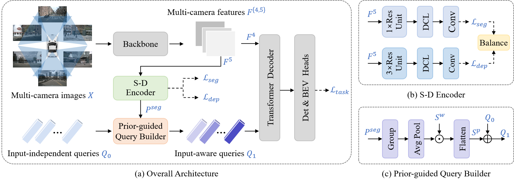

# Divide and Conquer: Improving Multi-Camera 3D Perception With 2D Semantic-Depth Priors and Input-Dependent Queries [TIP 2023]

[](https://ieeexplore.ieee.org/abstract/document/10407035/)

## Introduction

This repository is an official implementation of [SDTR](https://ieeexplore.ieee.org/abstract/document/10407035/)

<div align="center">
  
</div><br/>


We propose SDTR, a transformer-based framework that incorporates semantic and depth priors to improve the capability of inferring both semantic categories and 3D positions. SDTR got accepted by TIP (IEEE Transactions on Image Processing).


## Preparation

#### Environment

This implementation is built upon [PETR](https://github.com/megvii-research/PETR/blob/main/README.md), and the environment preparation stage can be found in this repo (or see [install.md](./install.md)).

#### Pretrained weights   

We provide the pre-trained weights of backbone networks and our SDTR at [gdrive](https://drive.google.com/drive/folders/1GgejgKFEKJw_ppPTBSfPBAjesDDBB3oP?usp=drive_link).
These weights have already been grouped into `ckpts` and `work_dirs` folders. 

#### Training Data

* Detection Data   
  Follow the mmdet3d to process the nuScenes dataset (https://github.com/open-mmlab/mmdetection3d/blob/master/docs/en/data_preparation.md).

* Segmentation Data  
  Download Map expansion from nuScenes dataset (https://www.nuscenes.org/nuscenes#download). Extract the contents (folders basemap, expansion and prediction) to your nuScenes `maps` folder.  
  Then build Segmentation dataset:

  ```
  cd tools
  python build-dataset.py
  ```

  Or download the processed data ( HDmaps.tar ) provided by [PETR](https://github.com/megvii-research/PETR/blob/main/README.md).

#### Auxiliary Supervision Data

Edit the scripts/configs.py file, first setting the `TASK_Flag` to choose the type of labels you want, and then setting the `DATA_DIR` and `SAVE_DIR` entries to the location of the NuScenes dataset and the desired ground truth folder respectively.

* Prepare depth labels
  ```
  python scripts/gen_depth_gt.py
  ```
* Prepare segmentation labels
  ```
  python scripts/gen_pvseg_gt.py
  ```

After preparation, the directory will be as follows:  

  ```
  SDTR
  ├── mmdetection3d
  ├── projects
  │   ├── configs
  │   ├── mmdet3d_plugin
  ├── tools
  ├── data
  │   ├── nuscenes
  │     ├── pv_labels
  │     ├    ├── det
  │     ├    ├── depth
  │     ├    ├── ...
  │     ├── HDmaps-nocover
  │     ├── ...
  ├── ckpts
  ├── README.md
  ```


## Train & inference

You can train the model following:

```bash
tools/dist_train.sh projects/configs/sdtr/sdtr_r50dcn_gridmask_p4.py 8 --work-dir work_dirs/sdtr_r50dcn_gridmask_p4/
```

You can evaluate the model following:

```bash
tools/dist_test.sh projects/configs/sdtr/sdtr_r50dcn_gridmask_p4.py work_dirs/sdtr_r50dcn_gridmask_p4/latest.pth 8 --eval bbox
```

## Visualize

You can generate the reault json following:

```bash
./tools/dist_test.sh projects/configs/sdtr/sdtr_r50dcn_gridmask_p4.py work_dirs/sdtr_r50dcn_gridmask_p4/latest.pth 8 --out work_dirs/pp-nus/results_eval.pkl --format-only --eval-options 'jsonfile_prefix=work_dirs/pp-nus/results_eval'
```

You can visualize the 3D object detection following:

```bash
python3 tools/visualize.py
```

## Main Results

|        config        |  NDS  |  mAP  |
| :------------------: | :---: | :---: |
| SDTR-r50-p4-1408x512 | 38.4% | 33.1% |
| SDTR-vov-p4-1408x512 | 48.2% | 43.0% |


## Acknowledgement

Many thanks to the authors of [mmdetection3d](https://github.com/open-mmlab/mmdetection3d) and [PETR](https://github.com/megvii-research/PETR/) .


## Citation

If you find this project useful for your research, please consider citing: 

```bibtex   
@article{song2024divide,
  title={Divide and Conquer: Improving Multi-Camera 3D Perception With 2D Semantic-Depth Priors and Input-Dependent Queries},
  author={Song, Qi and Hu, Qingyong and Zhang, Chi and Chen, Yongquan and Huang, Rui},
  journal={IEEE Transactions on Image Processing},
  year={2024},
  publisher={IEEE}
}
```

## Contact

If you have any questions, feel free to open an issue or contact us at qisong@link.cuhk.edu.cn.
